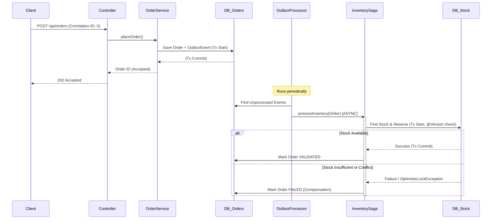

# Distributed Order Processing System: Architectural Breakdown

As a Lead Software Architect, this system was designed to handle high-scale order processing while ensuring data consistency and resilience in a distributed environment.

## 1. Life of a Request: Concurrent & Distributed Flow

1.  **Ingress & Context Creation**:
    *   A request hits the `OrderController`.
    *   A unique `Correlation-ID` is extracted or generated and placed into the **MDC (Mapped Diagnostic Context)**.
    *   This ID will follow the request through all logs, even across thread boundaries.

2.  **Order Creation (Atomicity via Outbox)**:
    *   `OrderService.placeOrder` executes within a `@Transactional` block.
    *   The `Order` aggregate is saved to the `orders` table.
    *   Simultaneously, an `OutboxEvent` is saved to the `outbox_events` table.
    *   **Locking Strategy**: JPA `@Version` on the `Order` aggregate provides **Optimistic Locking**, preventing lost updates if two threads try to modify the same order.
    *   **Blocking**: The thread blocks while waiting for the database transaction to commit.

3.  **Asynchronous Event Dispatch**:
    *   The `OutboxProcessor` (Scheduled Task) picks up the `ORDER_CREATED` event.
    *   It deserializes the order and invokes `InventorySagaService.processInventory`.

4.  **Saga Step: Inventory Reservation (Distributed Resilience)**:
    *   `InventorySagaService.processInventory` is marked as `@Async`. The execution moves from the scheduler thread to a dedicated `ThreadPoolTaskExecutor` thread.
    *   **Context Propagation**: The `MdcTaskDecorator` ensures the `Correlation-ID` is copied to the new thread.
    *   **Transaction Management**: `Propagation.REQUIRES_NEW` starts a fresh transaction for inventory work.
    *   **Resilience**: 
        *   **Circuit Breaker (Resilience4j)**: If the inventory logic fails repeatedly or is too slow, the circuit opens, immediately falling back to `fallbackInventory`.
        *   **Rate Limiter**: Prevents thread pool exhaustion by capping the number of concurrent inventory attempts.
    *   **State Protection**: The `Stock` entity uses `@Version` (Optimistic Locking). If multiple orders try to reserve the same item simultaneously, one will succeed, and others will throw `ObjectOptimisticLockingFailureException`, which our `GlobalExceptionHandler` or the Saga logic can handle (retry or fail).

5.  **Completion or Compensation**:
    *   If successful, the order status is updated to `VALIDATED`.
    *   If failure occurs (e.g., "Insufficient Stock"), a **Compensating Transaction** (`compensateInventory`) is triggered to mark the order as `FAILED`.

## 2. Technical Internals

### Tomcat vs. Spring TaskExecutor
*   **Tomcat `MaxThreads` (Default 200)**: Limits how many concurrent HTTP requests the server can "work on" at once.
*   **Tomcat `AcceptCount` (Default 100)**: The "waiting room" queue for connections when all 200 threads are busy.
*   **Spring `TaskExecutor`**: By offloading heavy work (like the Saga steps) to `@Async`, we free up Tomcat threads quickly to handle more incoming HTTP requests, improving throughput.

### State Protection: JVM vs. Distributed
*   **JVM Locking (`ReentrantLock`)**: Efficient for protecting shared state *within one instance*. Not suitable for this distributed system as we might have multiple instances of the Order Service.
*   **Database Optimistic Locking (`@Version`)**: The most scalable approach for distributed systems. It assumes conflicts are rare and verifies at the last moment (flush/commit).
*   **Distributed Locking (Redis/ShedLock)**: Used by our `OutboxProcessor` (implicitly via its design) to ensure only one instance processes a specific event at a time if we had multiple instances.

## 3. Visualization: Sequence of Events

