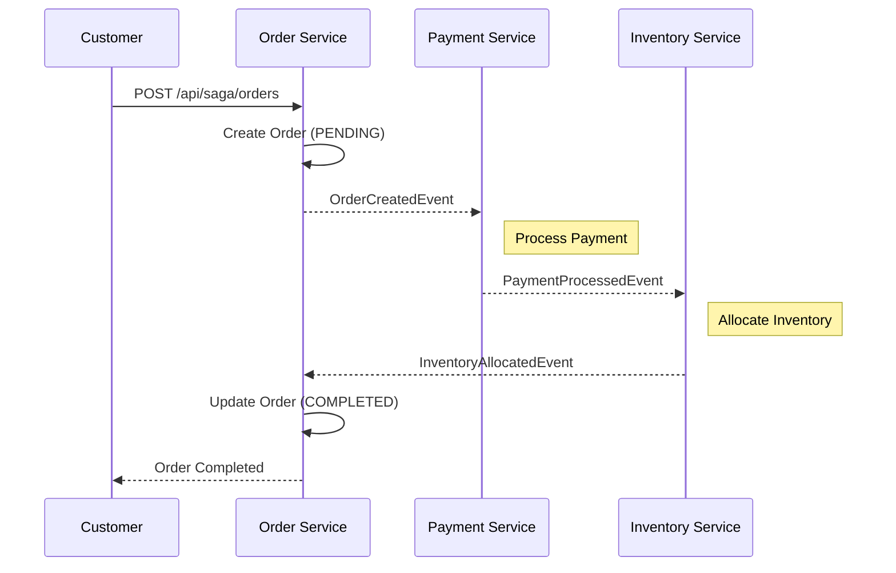
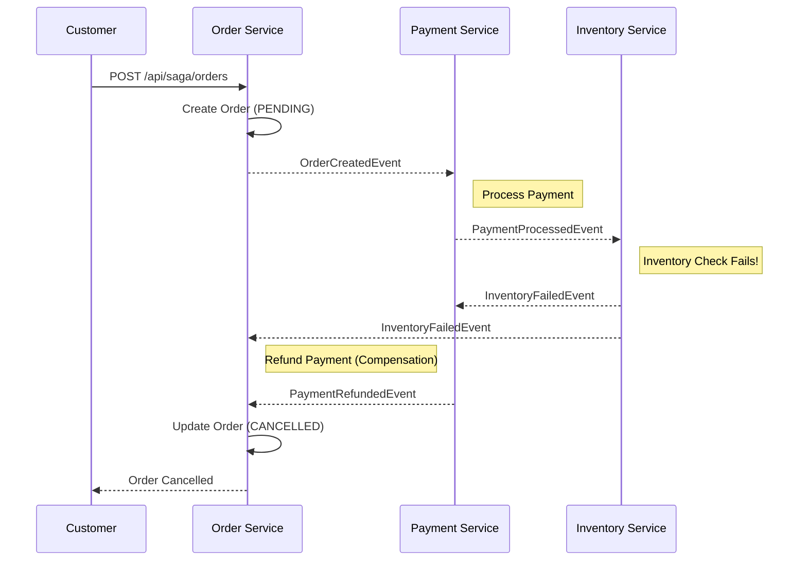

# Saga Pattern Implementation

## What is the Saga Pattern?

Imagine you are ordering a pizza online. A lot of things need to happen for you to get your pizza:
1. The app creates your **Order**.
2. The app charges your **Credit Card**.
3. The kitchen checks if they have the **Ingredients** (Inventory) and starts cooking.

In a modern software system, these tasks might be handled by different "services" (mini-apps). 
If everything goes well, it's easy. But what if the kitchen is out of pepperoni *after* you've already been charged?

In a traditional database, you could just "undo" everything at once. But in distributed systems, you can't easily undo a credit card charge just by clicking a button in the Kitchen service.

**The Saga Pattern** is the solution. It manages these multi-step processes by:
1. Running each step one by one.
2. If a step fails, it runs **Compensation Operations** (like a "Refund") to undo the previous successful steps.

---

## How This Implementation Works

This project demonstrates a **Choreography-based Saga**. Think of it like a dance where each dancer knows what to do when they see the previous dancer finish, without a "director" shouting orders.

### Architectural Overview

#### 1. The Success Path (The Happy Path)
This diagram shows how a successful order flows through the system.

1. **Order Service**: Creates an order in `PENDING` state and shouts: *"Hey, an order was created!"* (OrderCreatedEvent).
2. **Payment Service**: Hears the shout, charges the customer, and shouts: *"Payment is successful!"* (PaymentProcessedEvent).
3. **Inventory Service**: Hears the payment shout, reserves the items, and shouts: *"Inventory is ready!"* (InventoryAllocatedEvent).
4. **Order Service**: Hears the inventory shout and marks the order as `COMPLETED`.

#### 2. The Failure Path (Compensation)
This diagram shows what happens when something goes wrong (e.g., out of stock) and how the system "undoes" previous steps.

What if the Inventory is empty?
1. **Inventory Service**: Tries to reserve items but fails. It shouts: *"Inventory failed!"* (InventoryFailedEvent).
2. **Payment Service**: Hears the "Inventory failed" shout and says: *"Oh no, I already took the money! I better refund it."* (This is the **Compensation Operation**).
3. **Order Service**: Hears the failure shouts and marks the order as `CANCELLED`.

---

## Technical Details

- **Language**: Java 25
- **Framework**: Spring Boot
- **Communication**: Spring `ApplicationEventPublisher` (Simulating an asynchronous event bus like Kafka or RabbitMQ).
- **Storage**: In-memory `ConcurrentHashMap` (Simulating real databases).

### How to test it?

You can use the following API calls (e.g., via Postman or `curl`):

1. **Successful Order**:
   - Product: "Laptop", Price: 500, Quantity: 1
   - Result: Payment succeeds (< 1000), Inventory succeeds (we have 10 laptops). Order becomes `COMPLETED`.

2. **Payment Failure (Insufficient Funds)**:
   - Product: "Laptop", Price: 2000, Quantity: 1
   - Result: Payment fails (Total > 1000). Order becomes `CANCELLED`.

3. **Inventory Failure (Out of Stock)**:
   - Product: "Phone", Price: 500, Quantity: 1
   - Result: Payment succeeds, but Inventory fails (we have 0 phones). **Refund is triggered.** Order becomes `CANCELLED`.

### API Endpoints:
- `POST /api/saga/orders?product=Laptop&quantity=1&price=500` - Create an order
- `GET /api/saga/orders` - List all orders and their statuses
